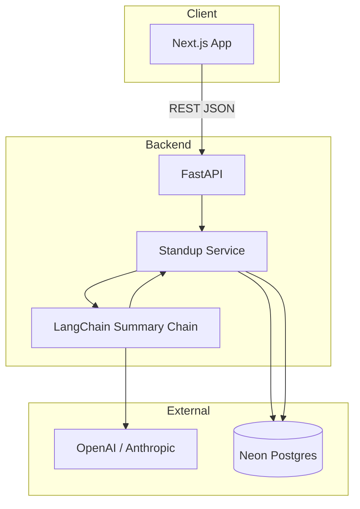

# Architecture

## High-level diagram



## Component responsibilities

| Component | Tech | Responsibility |
|-----------|------|----------------|
| **Next.js** | React 19, App Router, Tailwind | Team forms, summary display, copy-to-Slack, regenerate UX |
| **FastAPI** | Python 3.11+, Pydantic v2 | HTTP API, validation, CORS, error mapping |
| **SQLAlchemy** | async + asyncpg | ORM, Neon connection pool |
| **LangChain** | `langchain`, `langchain-openai` or `langchain-anthropic` | Prompt template + LLM invoke |
| **Neon Postgres** | Serverless Postgres | Team seed, entries, cached summary |

## Request paths

### Read path (page load)

```
Browser → GET /api/sessions/today → FastAPI
  → SELECT session WHERE session_date = CURRENT_DATE (or create)
  → SELECT entries JOIN team_members
  → JSON → render MemberCards
```

### Write path (edit standup)

```
Browser → PUT /api/sessions/{id}/entries/{member_id}
  → UPSERT standup_entries
  → Return updated row
```

### Summarize path (AI)

```
Browser → POST /api/sessions/{id}/summarize
  → Load all 4 entries (reject if any empty)
  → Build LangChain messages
  → llm.invoke() → markdown string
  → UPSERT standup_summaries (version++)
  → Return { content, version }
```

## LangChain design

```python
# Conceptual — see backend/app/services/langchain_summary.py

from langchain_core.prompts import ChatPromptTemplate
from langchain_openai import ChatOpenAI

prompt = ChatPromptTemplate.from_messages([
    ("system", SYSTEM_PROMPT),      # Zaha owns content
    ("human", "{standup_json}"),
])

chain = prompt | ChatOpenAI(model="gpt-4o-mini", temperature=0.3)
result = chain.invoke({"standup_json": entries_json})
```

**Why LangChain (vs raw SDK):**

- Clean separation of prompt template and model
- Easy swap OpenAI ↔ Anthropic via `ChatAnthropic`
- Hackathon judges can see structured AI pipeline in code

## Folder structure

```
hackathon26-alpha/
├── backend/
│   ├── app/
│   │   ├── main.py              # FastAPI app, CORS, routers
│   │   ├── config.py            # pydantic-settings
│   │   ├── db.py                # async engine + session
│   │   ├── models/              # SQLAlchemy ORM
│   │   ├── schemas/             # Pydantic request/response
│   │   ├── routers/
│   │   │   ├── health.py
│   │   │   ├── team.py
│   │   │   └── sessions.py      # entries + summarize
│   │   └── services/
│   │       ├── standup.py
│   │       └── langchain_summary.py
│   ├── requirements.txt
│   └── .env.example
├── frontend/
│   ├── app/
│   │   ├── page.tsx
│   │   └── layout.tsx
│   ├── components/
│   ├── lib/api.ts
│   └── package.json
└── docs/
```

## Backend dependencies (starter)

```
fastapi
uvicorn[standard]
sqlalchemy[asyncio]
asyncpg
pydantic-settings
langchain
langchain-core
langchain-openai
# langchain-anthropic  # optional
python-dotenv
```

## Security (hackathon scope)

- No auth — local/demo only
- API keys server-side only (never in Next.js public env)
- CORS restricted to `localhost:3000` + demo URL
- Neon connection uses SSL (`sslmode=require`)

## Deployment options (if time permits)

| Tier | Frontend | Backend | DB |
|------|----------|---------|-----|
| **Demo default** | `npm run dev` | `uvicorn` local | Neon cloud |
| **Stretch** | Vercel | Railway / Render | Neon |

## Failure modes

| Failure | User sees | Backend behavior |
|---------|-----------|------------------|
| Incomplete entries | "Fill all fields for every teammate" | 400 before AI call |
| LLM timeout/error | "Summary failed — try again" | 502, log error |
| DB unreachable | "Cannot reach server" | 503 |
| Regenerate | New AI call, `version` increments | Old summary overwritten |
