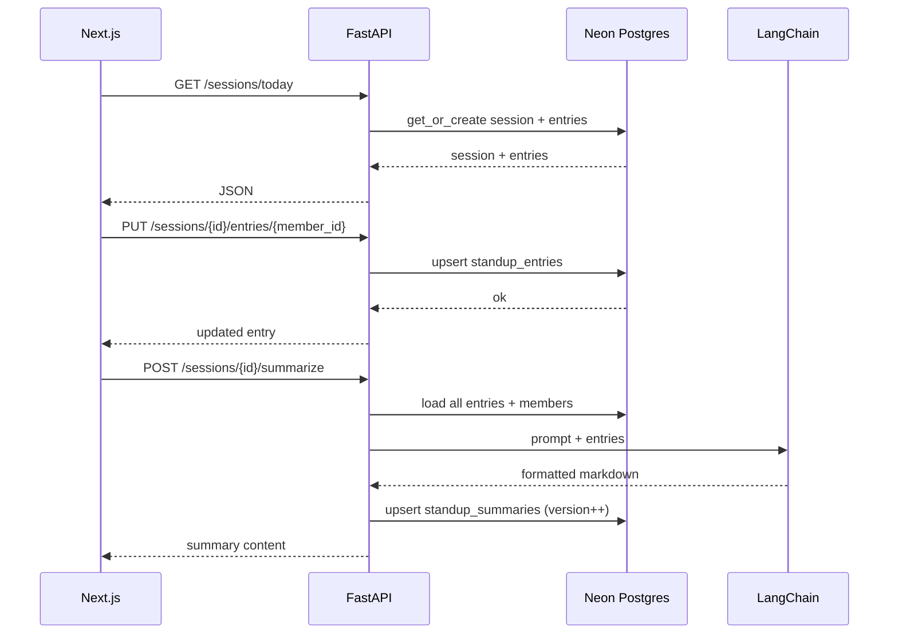

# ERD — Entity Relationship Diagram

**Database:** Neon Postgres  
**ORM:** SQLAlchemy (async) in FastAPI

## Conceptual model

```mermaid
erDiagram
    TEAM_MEMBERS ||--o{ STANDUP_ENTRIES : submits
    STANDUP_SESSIONS ||--|{ STANDUP_ENTRIES : contains
    STANDUP_SESSIONS ||--o| STANDUP_SUMMARIES : generates

    TEAM_MEMBERS {
        int id PK
        string name UK
        int display_order
        timestamp created_at
    }

    STANDUP_SESSIONS {
        uuid id PK
        date session_date UK
        string status
        timestamp created_at
        timestamp updated_at
    }

    STANDUP_ENTRIES {
        uuid id PK
        uuid session_id FK
        int member_id FK
        text yesterday
        text today
        text blockers
        timestamp updated_at
    }

    STANDUP_SUMMARIES {
        uuid id PK
        uuid session_id FK UK
        text content
        string model
        int version
        timestamp created_at
    }
```

## Relationships

| From | To | Cardinality | Notes |
|------|-----|-------------|-------|
| `team_members` | `standup_entries` | 1:N | One member has many entries across sessions |
| `standup_sessions` | `standup_entries` | 1:N | One session has one entry per member |
| `standup_sessions` | `standup_summaries` | 1:1* | Latest summary per session; `version` increments on regenerate |

\* For hackathon simplicity: **upsert** on `session_id` — update `content` and bump `version` on regenerate.

## Entity details

### `team_members`

Hardcoded team list. Seeded once; no CRUD UI in v1.

| Column | Type | Constraints |
|--------|------|-------------|
| `id` | `SERIAL` | PK |
| `name` | `VARCHAR(100)` | NOT NULL, UNIQUE |
| `display_order` | `INT` | NOT NULL, default 0 |
| `created_at` | `TIMESTAMPTZ` | DEFAULT `now()` |

### `standup_sessions`

Represents one standup cycle (typically one calendar day).

| Column | Type | Constraints |
|--------|------|-------------|
| `id` | `UUID` | PK, default `gen_random_uuid()` |
| `session_date` | `DATE` | NOT NULL, UNIQUE |
| `status` | `VARCHAR(20)` | `draft` \| `summarized` |
| `created_at` | `TIMESTAMPTZ` | DEFAULT `now()` |
| `updated_at` | `TIMESTAMPTZ` | DEFAULT `now()` |

### `standup_entries`

Three fields per person per session.

| Column | Type | Constraints |
|--------|------|-------------|
| `id` | `UUID` | PK |
| `session_id` | `UUID` | FK → `standup_sessions.id` ON DELETE CASCADE |
| `member_id` | `INT` | FK → `team_members.id` |
| `yesterday` | `TEXT` | DEFAULT `''` |
| `today` | `TEXT` | DEFAULT `''` |
| `blockers` | `TEXT` | DEFAULT `''` |
| `updated_at` | `TIMESTAMPTZ` | DEFAULT `now()` |

**Unique:** `(session_id, member_id)` — one row per person per session.

### `standup_summaries`

AI-generated output from LangChain.

| Column | Type | Constraints |
|--------|------|-------------|
| `id` | `UUID` | PK |
| `session_id` | `UUID` | FK → `standup_sessions.id`, UNIQUE |
| `content` | `TEXT` | NOT NULL |
| `model` | `VARCHAR(50)` | e.g. `gpt-4o-mini` |
| `version` | `INT` | DEFAULT 1, increment on regenerate |
| `created_at` | `TIMESTAMPTZ` | DEFAULT `now()` |

## Data flow



## Indexes

```sql
CREATE UNIQUE INDEX idx_entries_session_member ON standup_entries (session_id, member_id);
CREATE UNIQUE INDEX idx_sessions_date ON standup_sessions (session_date);
CREATE UNIQUE INDEX idx_summaries_session ON standup_summaries (session_id);
```

## What we deliberately omit

- Users / auth tables
- Multi-team `teams` table (single team only)
- Audit log / full history (only latest summary per session; entries overwritten on edit)

See `DATABASE.md` for full DDL and seed script.
